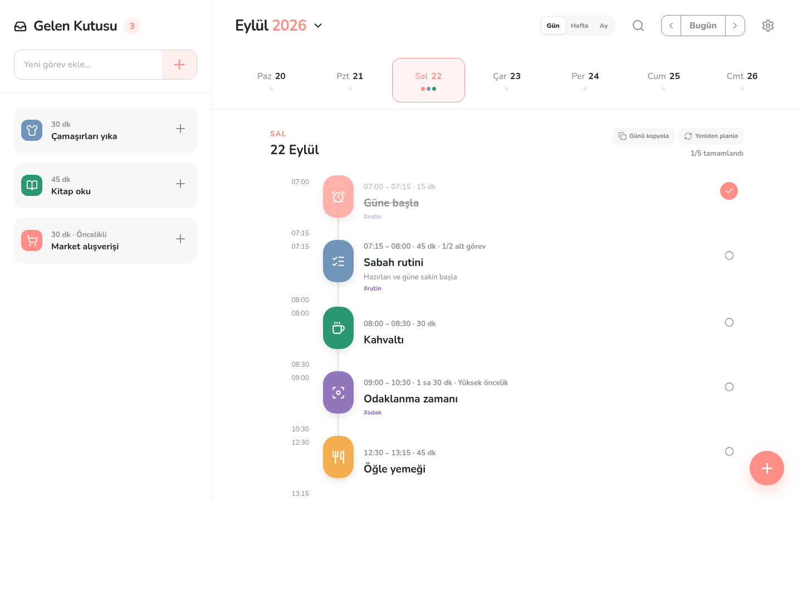
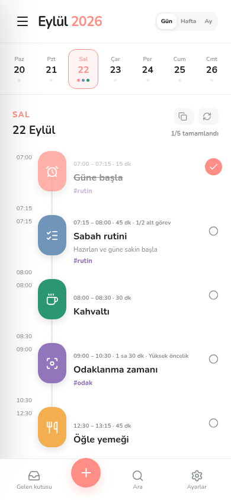

<div align="center">
  
  <h1>Akış</h1>
  <p>Görevlerini, gelen kutunu ve günlük programını<br>tek bir görsel zaman çizgisinde buluşturan açık kaynak planlayıcı.</p>

  [](https://takvim-app-chi.vercel.app)
  [](https://react.dev/)
  [](#testler)
  [](LICENSE)

  **[Canlı uygulamayı aç](https://takvim-app-chi.vercel.app)**
</div>



## Özellikler

- **Görsel zaman çizelgesi:** Günün görevlerini saat, süre, renk ve durum bilgileriyle tek akışta gör.
- **Hızlı gelen kutusu:** Aklına gelen işi zaman belirlemeden kaydet, hazır olduğunda tek dokunuşla bugüne planla.
- **Haftalık gezinme:** Haftanın günleri arasında geçiş yap ve yoğunluğu renkli göstergelerle takip et.
- **Eksiksiz görev yönetimi:** Başlık, tarih, başlangıç saati, süre, renk ve not alanlarıyla görev oluştur, düzenle veya sil.
- **İlerleme takibi:** Tamamlanan görevleri işaretle ve günün ilerlemesini anlık gör.
- **Açık ve koyu tema:** Tercih edilen görünüm cihazda kalıcı olarak saklanır.
- **Çevrimdışı PWA:** Ana ekrana kurulabilir; uygulama kabuğu ve tipografi internet olmadan çalışır.
- **Yerel ve özel:** Görevler dış servise gönderilmez, yalnızca tarayıcının yerel depolamasında tutulur.
- **AI içermez:** Planlama akışı tamamen kullanıcı kontrolündedir.

## Mobil deneyim

<p align="center">
  
</p>

Mobil görünüm; kompakt haftalık seçici, dokunmatik görev kontrolleri, kayan gelen kutusu ve hızlı ekleme navigasyonuyla bağımsız bir uygulama hissi verir.

## Kurulum

Gereksinimler: Node.js 20 veya üzeri ve npm.

```bash
git clone https://github.com/kadircicek34/akis-daily-planner.git
cd akis-daily-planner
npm ci
npm run dev
```

Üretim paketini oluşturmak ve yerel olarak görüntülemek için:

```bash
npm run build
npm run preview
```

## PWA olarak kurma

Canlı uygulamayı Chrome, Edge veya Safari ile aç. Tarayıcının **Uygulamayı yükle** ya da **Ana Ekrana Ekle** seçeneğini kullan. İlk ziyaretin ardından uygulama çevrimdışı olarak yeniden açılabilir.

## Testler

Üretim önizlemesi; masaüstü ve mobil yerleşim, yatay taşma, görev oluşturma, manifest ve çevrimdışı service worker davranışı açısından gerçek Chromium oturumunda doğrulanır.

```bash
npm run test:ci
```

## Teknik yapı

- React 19 ve TypeScript
- Vite 7 üretim derlemesi
- `vite-plugin-pwa` ve Workbox service worker
- Lucide SVG ikonları
- Harici API veya sunucu gerektirmeyen `localStorage` veri katmanı
- Masaüstü, tablet ve telefon için duyarlı CSS
- Vercel üzerinde otomatik statik dağıtım

## Veri ve gizlilik

Akış hesap oluşturmaz ve analitik kodu içermez. Görevler, notlar ve tema tercihi yalnızca kullanılan tarayıcıda saklanır. Tarayıcı verileri temizlendiğinde yerel plan da silinir.

## Katkı

Hata bildirimi ve geliştirme önerileri için issue açabilir, değişiklikler için pull request gönderebilirsin.

## Lisans

Bu proje [MIT Lisansı](LICENSE) ile yayımlanmıştır.
